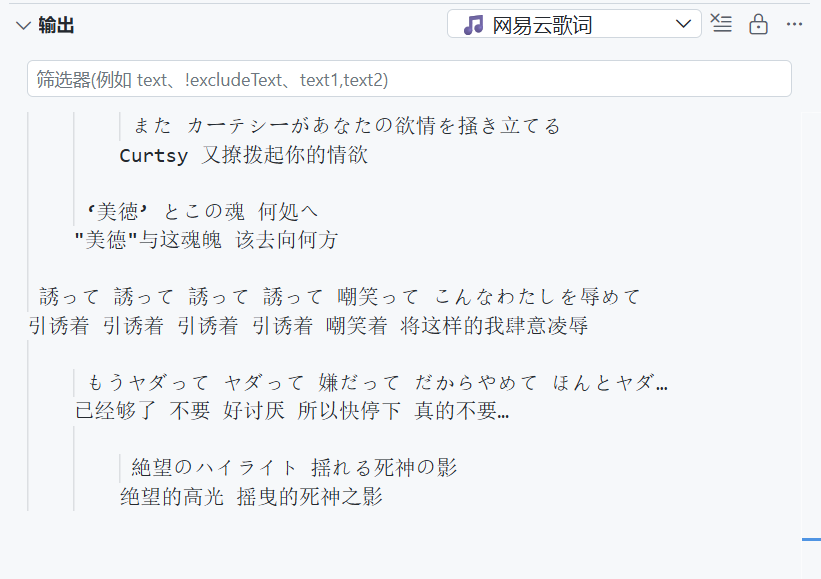

# 🎵 网易云歌词输出 (Lyric Output)

在 VS Code 中实时显示网易云音乐的同步歌词。



---

## 下载

- 📦 **最新版本**：<https://github.com/Astesias/lyric-output-extension/releases/latest>
- ⬇️ **直接下载 v0.0.1**：[`lyric-output-0.0.1.vsix`](https://github.com/Astesias/lyric-output-extension/releases/download/v0.0.1/lyric-output-0.0.1.vsix)

> 下载 `.vsix` 后，在 VS Code 扩展面板右上角 `⋯` → **从 VSIX 安装…** 选择该文件即可。

---

## 功能特性

- 🎧 **实时歌词同步**：通过 Windows SMTC 检测当前播放歌曲，自动获取并同步显示歌词
- 📝 **原文 + 翻译**：同时显示 LRC 原文歌词和翻译歌词（蓝色标注）
- 🗂️ **歌词缓存**：本地缓存已获取的歌词，避免重复请求 API
- ⏪ **进度条回退**：拖动进度条往回或往前，歌词自动定位到正确位置
- 🌐 **Web API 服务器**（可选）：启动 Flask HTTP 服务，供 OBS / 直播助手等外部程序读取歌词
- 🎨 **终端美化**：支持 ANSI 颜色、滚动式歌词展示（前 2 句 + 当前 + 后 2 句）
- ⚙️ **灵活配置**：支持时间偏移、计时方案切换、歌名显示等

---

## 环境要求

| 依赖 | 说明 |
|------|------|
| **Windows 10/11** | SMTC 需要 Windows 系统支持 |
| **Python 3.7+** | 推荐 Anaconda / Miniconda |
| **VS Code 1.60+** | 扩展运行环境 |
| **网易云音乐（新版网易云已原生支持 SMTC）** | UWP 版，或桌面版[**配置 SMTC 支持**](#让网易云支持-smtc) |

### 让网易云支持 SMTC（新版网易云已原生支持 SMTC）

> 💡 新版网易云已原生支持 SMTC，若仅需 SMTC 可不装插件；但 BetterNCM 的 SMTC 更稳定，且附带界面美化。
> 若扩展市场报 403，可在 BetterNCM 设置中更换扩展源。

借助 BetterNCM 桥接。完整图文教程见：
👉 **[让网易云支持 SMTC - 一叶舟记](https://blog.lonzov.top/posts/betterncm/)**


### Python 依赖

```bash
pip install requests pycryptodome flask flask-cors winsdk
```

---

## 项目结构

```
lyric-output-extension/
├── package.json        # VS Code 扩展配置
├── extension.js        # 扩展入口（启动 Python 子进程）
├── main4.py            # 核心：歌词获取、解析、同步显示
├── timer.py            # 计时器（SMTC 播放进度 / 系统时钟）
├── lyric_cache.py      # 歌词缓存模块（本地 JSON）
├── utils.py            # HTTP 请求工具 + 静音上下文
├── soc.py              # Flask Web 服务器（可选）
├── config.json         # 运行时配置（自动生成）
├── lyric_cache.json   # 歌词缓存文件（自动生成）
└── README.md           # 本文件
```

---

## 快速开始

### 1. 安装扩展

**方式 A：直接放入扩展目录（推荐本地/开发使用）**

将整个文件夹放入 VS Code 的扩展目录即可。**如何找到扩展目录？**

- **面板方式（最省事，跨平台）**：`Ctrl+Shift+P` 打开命令面板 → 输入
  `Extensions: Open Extensions Folder`（中文界面：**扩展: 打开扩展文件夹**）→ 回车，
  系统文件管理器会直接打开该目录
- **手动路径**（默认位置）：

  | 系统 | 路径 |
  |------|------|
  | Windows | `%USERPROFILE%\.vscode\extensions`（即 `C:\Users\<用户名>\.vscode\extensions`） |
  | macOS / Linux | `~/.vscode/extensions` |

  > 若使用 VS Code Insiders / 便携版等，目录名会不同（如 `.vscode-insiders`），以命令面板方式为准。

**方式 B：打包成 `.vsix` 安装**

```bash
npm install -g @vscode/vsce
vsce package                 # 生成 lyric-output-<版本>.vsix
```

然后在 VS Code 扩展面板 → 右上角 `...` → **从 VSIX 安装…**
（或命令面板 `Extensions: Install from VSIX...`）选择生成的 `.vsix` 文件。

### 2. 配置 Cookie 与 csrf_token（必须）

歌词接口需要登录态，必须提供 **Cookie** 和 **csrf_token** 两项。获取步骤：

1. **登录网页版**：浏览器打开 <https://music.163.com> 并登录账号
2. **打开开发者工具**：按 `F12`（或右键 → 检查），切到 **网络 / Network** 面板
3. **触发并筛选请求**：在页面播放任意一首歌；在筛选框中输入 `lyric`，找到形如
   `lyric?csrf_token=xxxx` 的请求（类型 Fetch/XHR）
4. **取 csrf_token**：点开该请求 → **负载 / Payload** 标签 → 「查询字符串参数」→ 复制 `csrf_token` 的值
5. **取 Cookie**：同一个请求 → **标头 / Headers** 标签 → 「请求标头 / Request Headers」→ 复制 `Cookie:` 后的**完整字符串**

然后打开 VS Code 设置 → 扩展 → 🎵 网易云歌词，分别填入：

- **Cookie**：第 5 步复制的完整 Cookie 字符串
- **csrfToken**：第 4 步复制的 `csrf_token`（与 Cookie 中的 `__csrf` 值相同）

> ⚠️ 这两项等同于你的账号登录凭证，**切勿泄露或提交到公开仓库**。本项目已通过 `.gitignore` 排除 `config.json`。

> 💡 也可以直接编辑项目根目录的 `config.json`：
> ```json
> {
>     "csrf_token": "你的csrf",
>     "cookie": "你的完整cookie",
>     "user_agent": "Mozilla/5.0 ...",
>     "time_offset": -0.6,
>     "timer_mode": "smtc"
> }
> ```

### 3. 启动

- 点击 VS Code 右下角状态栏的 **🎵 启动**
- 或按 `Ctrl+Shift+P` → 输入 `歌词同步: 启动/停止`
- 在输出面板查看歌词

### 4. 命令行直接运行（不需要 VS Code）

```bash
# 纯终端模式
python main4.py

# 纯终端 + 无颜色
python main4.py --plain

# 启动 Web API 服务器（默认端口 62333）
python main4.py -s

# 指定 Web 服务器端口
python main4.py -s 8080

# 叠加时间偏移（与配置文件相加）
python main4.py -offset 0.3        # 歌词延迟 0.3 秒
python main4.py -offset -0.5       # 歌词提前 0.5 秒
python main4.py -s -offset 0.2     # 组合使用
```

---

## 配置说明

| 配置项 | 默认值 | 说明 |
|--------|--------|------|
| `pythonPath` | `C:/ProgramData/Anaconda/python.exe` | Python 解释器路径 |
| `cookie` | — | 网易云音乐 Cookie |
| `csrfToken` | — | Cookie 中的 `__csrf` |
| `timeOffset` | `-0.6` | 歌词时间偏移（秒），负数 = 延迟触发 |
| `timerMode` | `smtc` | `smtc`（播放器进度）或 `wall_clock`（系统时钟） |
| `showTitleInStatusBar` | `true` | 状态栏是否显示歌名 |
| `showTitleInLyrics` | `false` | 每次歌词输出是否附带歌名行 |

---

## Web API（`-s` 模式）

启动后访问 `http://127.0.0.1:62333/BGMName` 获取 JSON：

```json
{
    "AppName": "网易云音乐",
    "Title": "夜曲 - 周杰伦",
    "AllTime": "245000",
    "Now": "15000",
    "ChineseLryic": "失去你 爱恨开始分明",
    "Lryic": "xxxxxx",
    "FormattedTime": ""
}
```

| 字段 | 说明 |
|------|------|
| `Title` | 歌曲标题（含歌手） |
| `AllTime` | 歌曲总时长（毫秒） |
| `Now` | 当前播放位置（毫秒） |
| `Lryic` | 当前原文歌词 |
| `ChineseLryic` | 当前翻译歌词 |

---

## 歌词显示效果

```
🎵 夜曲 - 周杰伦

		一群嗜血的蚂蚁 被腐肉所吸引              ← 前第2句
		A swarm of ants drawn to rotting flesh

	我面无表情 看孤独的风景                      ← 前第1句
	I watch the lonely scenery with a blank face

为你弹奏肖邦的夜曲 纪念我死去的爱情             ← 当前（蓝色高亮）
Playing Chopin's nocturne for you

	跟夜风一样的声音 心碎的很好听               ← 后第1句
	A voice like the night wind

		手在键盘敲很轻 我给的思念很小心          ← 后第2句
		Fingers gently tapping the keys
```

- 始终显示 **5 行**（前2句 + 当前 + 后2句），当前句顶格，越远缩进越多
- 当前句以 **蓝色** 高亮，翻译同样蓝色
- 翻译歌词紧跟原文下方，无原文时单独成行
- 自动跳过空行/纯音乐行

---

## 常见问题

**Q: 显示"搜索不到歌曲"？**
A: Cookie 可能过期，请重新从浏览器获取并更新配置。

**Q: 歌词不同步？**
A: 调整 `timeOffset` 参数，负数让歌词晚出现，正数让歌词早出现。

**Q: SMTC 检测不到歌曲？**
A: 确保使用网易云 UWP 版或最新版，或桌面版[配置了 SMTC 支持](#让网易云支持-smtc)（BetterNCM + InfLink-rs）。

**Q: 歌词只有原文没有翻译？**
A: 部分歌曲本身没有上传翻译歌词，并非程序问题。

---

## 许可

个人学习用途，歌词版权归网易云音乐所有。
